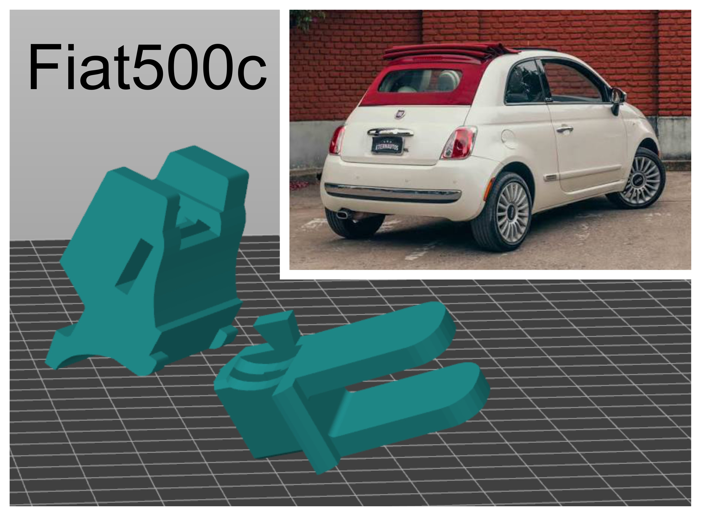
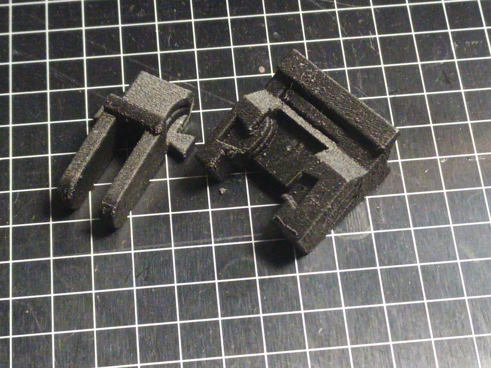
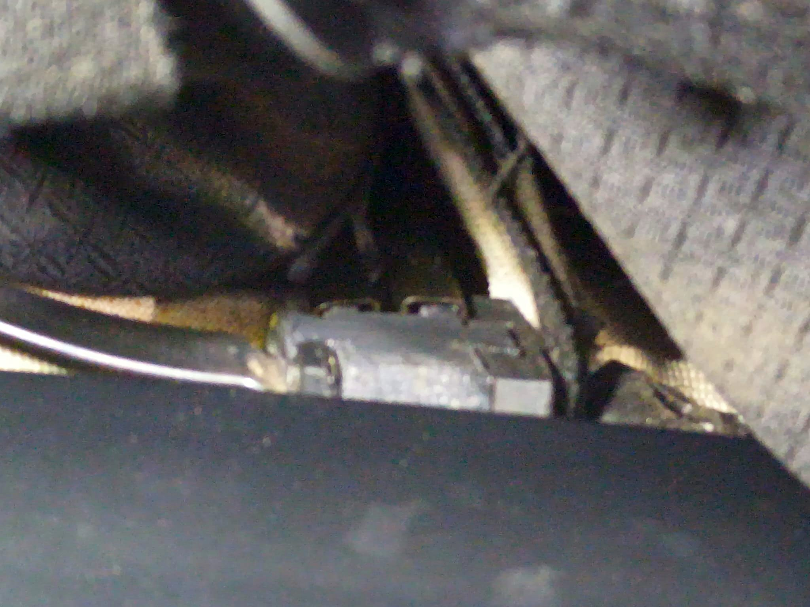

# Fiat 500C Roof Bracket - No Disassembly Fix

Common Fiat 500C (2009-present) failure - original plastic brackets crumble after sun exposure. Dealer fix = remove entire roof, 500-800€.

### This fix
- 2-part bracket that clips from both sides
- Flat locking bar that locks it - no glue needed (glue melts at 85°C on black roof, tested in Canary Islands)
- No roof disassembly
- Designed from broken originals 2025-02-07

### What to print

- [bracket_inner.stl](STL/bracket_inner.stl) - L/R mirrored in slicer
- [bracket_outer.stl](STL/bracket_outer.stl) - L/R mirrored in slicer

For inter-lock reuses original Fiat metal rod.

### How to print (no chamber)
My setup for ABS without enclosure:
- Full-height skirt as draft shield - creates hot air curtain
- G-code modifier:
    - Fan 0% for layers 1-3 for better adhesion
    - Outer walls: fan 70%
    - Inner walls: fan 0%, flow 105% over-extrusion
    - Hot air recirculation - blower that collects hot air from nozzle and pushes back
- Material: ABS. PETG, PLA softens in summer on black roof.

### Install
1. Remove crumbs of old plastic bracket
2. Slide inner bracket onto the roof support - double tube / rail
3. Slide inner bracket part into outer bracket part
4. Clip outer and inner brackets together - it locks on the metal bar slided in, no glue

More functional 3D prints and acoustic projects: https://deltasignum.org
Original acoustic project: DeltaSignum/Dynamic-Zero

### License
【entity-MIT¦canonical_name=MIT】
